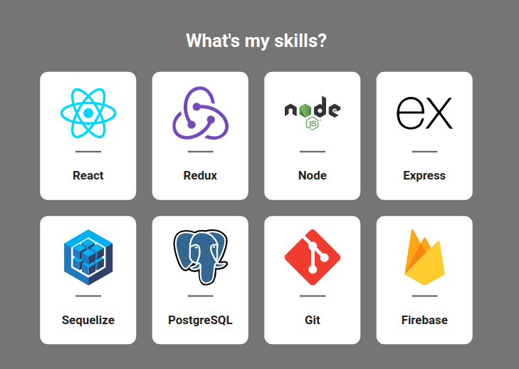
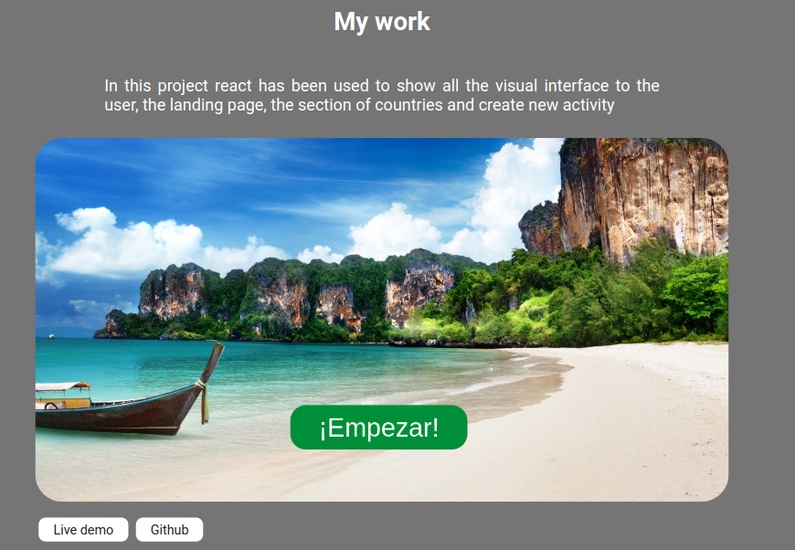

# Hi!

This is my portfolio actually in development!

## What technologies is used ?

This proyect is builded in:
- React
- React-router-dom
- Redux

## What is the purpose of the proyect ?

My idea was show my tech and theorical skills!, for example in the home page you can see a section of techSkills

And in the section of teorical skills you can see

# And no more?

The cards are button!, at this moment if you click in a theorical skill you can see a example of this skill, how? A LeetCode problem! example:

The idea is make the same thing with the tech skills, in a near future you can see in what part of a proyect i use a specific tech!  

If you interested in see more about my portfolio see this here!: [portfolio-sanrinconr.vercel.app](https://portfolio-sanrinconr.vercel.app/)

